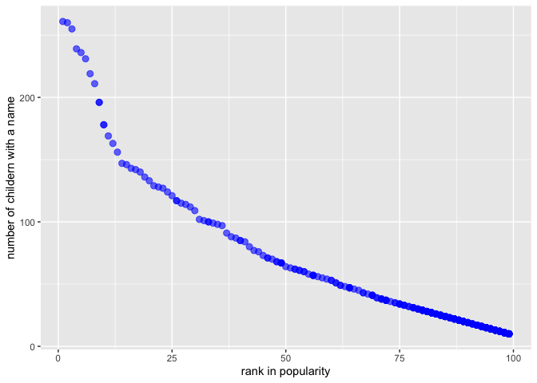

p8105\_hw2\_rq2166
================
Ruoyuan Qian
2019/9/28

``` r
library(tidyverse)
library(readxl)
library(dplyr)
```

# Problem 1

Read and clean the `Mr. Trash Wheel sheet`

``` r
## read the specific dataset with reasonable column names
## omit rows not include specific values of dumpster
## round sports ball to the nearest integer and convert to integer value
Trash_Wheel = 
   read_excel( "./data/Trash-Wheel-Collection-Totals-8-6-19.xlsx",
               sheet = "Mr. Trash Wheel",
               range = "A2:N408")%>%
   janitor::clean_names()%>%
   drop_na( dumpster )%>%
   mutate( sports_balls = round( sports_balls,0 ),
           sports_balls = as.integer( sports_balls ))
```

Read and clean `precipitation data` for 2017 and 2018

``` r
precipitation_2018 = 
  read_excel( "./data/Trash-Wheel-Collection-Totals-8-6-19.xlsx",
             sheet = "2018 Precipitation",
             skip  = 1 )%>%
  janitor::clean_names()%>%
  drop_na()%>%
  mutate( year = 2018 )

precipitation_2017 = 
  read_excel( "./data/Trash-Wheel-Collection-Totals-8-6-19.xlsx",
             sheet = "2017 Precipitation",
             skip  = 1 )%>%
  janitor::clean_names()%>%
  drop_na()%>%
  mutate( year = 2017 )

## combine 2 datasets
precipitation = bind_rows( precipitation_2018,
                           precipitation_2017 )%>%
                mutate( month = as.integer(month),
                        month = month.name[month]) %>% 
                select(year,month,everything())
```

**Description:**

`Mr. Trash Wheel`

The number of observation in `Trash_Wheel` is `344`. And there are `14`
variables in it.

The key variables in `Mr. Trash Wheel` spreadsheet include information
on the dumpter number(`dumpster`), date of collection(`year`, `month`,
`date`), amount of total litter(`weight_tons`, `volume_cubic_yards`) and
litter type(`Plastic Bottles`, `Glass Bottles`, `Grocery Bags`, `Chip
Bags`, `Sports Balls`). Additionally, it contians Homes Powered(`Homes
Powered*`) - Each ton of trash equates to on average 500 kilowatts of
electricity.

`precipitation`

The number of observation in `precipitation` is `24`, and there are `3`
variables in it. The key variable in `precipitation` is the amount of
precipitation(`total`) at different time.

**Total and Median**

The `total` precipitation in 2018 is `70.33`, the `median` number of
`sports balls` in a dumpster in 2017 is `8`.

# Problem 2

Clean the data in `pols-month.csv`

``` r
pols_month = 
  read_csv ( "./data/fivethirtyeight_datasets/pols-month.csv" )%>%
  separate ( mon, c("year","month","day"), "-" )%>%
  pivot_longer(
    c( prez_gop,prez_dem ),
    names_to = "president",
    names_prefix = "prez_" )%>%
  filter ( value != 0) %>%
  select ( -day,-value)%>%
  mutate (
    month = as.integer(month),
    month = month.name[month])
```

Clean the data in `snp.csv`

``` r
snp = 
  read_csv( "./data/fivethirtyeight_datasets/snp.csv" )%>%
  separate( date, c("month","day","year"), "/" )%>%
  select( -day ) %>%
  mutate(
    month = as.integer(month)) %>% 
    arrange( year,month) %>% 
  mutate(
    month = month.name[month]) %>% 
  select ( year,month,everything()) 
```

Tidy the `unemployment.csv`

``` r
unemployment = 
  read_csv( "./data/fivethirtyeight_datasets/unemployment.csv" )%>%
  pivot_longer(
    Jan:Dec,
    names_to  = "month",
    values_to = "unemployment" )%>%
  rename ( year = Year)%>%
  mutate ( year  = as.character(year),
          month  = match(month,month.abb),
          month  = month.name[month] )
```

Merge `snp` into `pols` , and merging `unemployment` into the `result`

``` r
  tem_result = left_join( pols_month , snp,
                        by=c("year","month"))

  result     = left_join( tem_result , unemployment,
                        by=c("year","month"))
```

**Summary of `pols_month`:**

According to the discription of `pols_month`, `prez_gop` represents
indicator of whether the president was `republican` on the associated
date (1 = yes, 0 = no), but there are five observations in `prez_gop` in
year 1974 containing value `"2"`. I grouped these observations in to
`gop`, since `prez_dem`(the indicator of whether the president was
`democratic` on the associated date (1 = yes, 0 = no)) of these five
observations is `"0"`.

The variable number is `9`, the number of observation is `822`, the
`range of years` is from `1947` to `2015`. The dataset is about the
number of national politicians who are democratic or republican at any
given time. The key variables include the number of governors of
different parties associated with the date(`gov_gop`, `gov_dem`), the
number of representatives of different parties on the associated
date(`rep_gop`, `rep_dem`), the number of senators of different parties
on the associated date(`sen_gop`, `sen_dem`) and indicator of whether
the president was republican or democratic on the associated
date(`president`).

**Summary of `snp`:**

The variable number in `snp` is `3`. The number of observation in `snp`
is `787`. The `range of years` in `snp` is from `1950` to `2015`. The
dataset is related to Standard & Poor’s stock market index (S\&P), the
key variable is the closing values of the S\&P stock index on the
associated date(`close`).

**Summary of `unemployment`:**

The variable number in `unemployment` is `3`. The number of observation
in `unemployment` is `816`.The `range of years` in `unemployment` is
from `1948` to `2015`. The key variable is the percentage of
unemployment in associated year on the associated date(`unemployment`).

**Summary of `result`:**

In result, the number of observations and variables is `822, 11`,
respectively. The range of years is from`1947` to `2015`. The key
variables are `gov_gop`, `gov_dem`，`rep_gop`, `rep_dem`, `sen_gop`,
`sen_dem`, `president`, `close` and `unemployment`.

# problem 3

Tidy data
`Popular_Baby_Names.csv`

``` r
## change ethnicity and childs_first_name into consistent formats respectively
## remove duplicate rows
Popular_Baby_Names = 
  read_csv("./data/Popular_Baby_Names.csv")%>%
  janitor::clean_names()%>% 
  mutate(
     ethnicity = 
       recode(ethnicity, 
               "ASIAN AND PACI" = "ASIAN AND PACIFIC ISLANDER",
               "BLACK NON HISP" = "BLACK NON HISPANIC",
               "WHITE NON HISP" = "WHITE NON HISPANIC"),
     childs_first_name = str_to_title ( childs_first_name )) %>% 
  distinct()
```

Make table of popularity of the name “Olivia”

``` r
popularity_of_olivia =
  Popular_Baby_Names %>% 
  filter(childs_first_name == "Olivia") %>% 
  select(-count) %>% 
  pivot_wider(names_from  = year_of_birth, 
              values_from = rank) %>%
  select(-gender,-childs_first_name) %>% 
  knitr::kable(
               caption = "Table 1  The rank in popularity of the name “Olivia” as a female baby name over time ",
               format = "html")
  
popularity_of_olivia
```

<table>

<caption>

Table 1 The rank in popularity of the name “Olivia” as a female baby
name over time

</caption>

<thead>

<tr>

<th style="text-align:left;">

ethnicity

</th>

<th style="text-align:right;">

2016

</th>

<th style="text-align:right;">

2015

</th>

<th style="text-align:right;">

2014

</th>

<th style="text-align:right;">

2013

</th>

<th style="text-align:right;">

2012

</th>

<th style="text-align:right;">

2011

</th>

</tr>

</thead>

<tbody>

<tr>

<td style="text-align:left;">

ASIAN AND PACIFIC ISLANDER

</td>

<td style="text-align:right;">

1

</td>

<td style="text-align:right;">

1

</td>

<td style="text-align:right;">

1

</td>

<td style="text-align:right;">

3

</td>

<td style="text-align:right;">

3

</td>

<td style="text-align:right;">

4

</td>

</tr>

<tr>

<td style="text-align:left;">

BLACK NON HISPANIC

</td>

<td style="text-align:right;">

8

</td>

<td style="text-align:right;">

4

</td>

<td style="text-align:right;">

8

</td>

<td style="text-align:right;">

6

</td>

<td style="text-align:right;">

8

</td>

<td style="text-align:right;">

10

</td>

</tr>

<tr>

<td style="text-align:left;">

HISPANIC

</td>

<td style="text-align:right;">

13

</td>

<td style="text-align:right;">

16

</td>

<td style="text-align:right;">

16

</td>

<td style="text-align:right;">

22

</td>

<td style="text-align:right;">

22

</td>

<td style="text-align:right;">

18

</td>

</tr>

<tr>

<td style="text-align:left;">

WHITE NON HISPANIC

</td>

<td style="text-align:right;">

1

</td>

<td style="text-align:right;">

1

</td>

<td style="text-align:right;">

1

</td>

<td style="text-align:right;">

1

</td>

<td style="text-align:right;">

4

</td>

<td style="text-align:right;">

2

</td>

</tr>

</tbody>

</table>

Make table of the most popular name among male children over time

``` r
popular_name_of_male =
  Popular_Baby_Names %>% 
  filter(rank == 1 & gender == "MALE") %>% 
  select(-count) %>% 
  pivot_wider(
    names_from  = year_of_birth, 
    values_from = childs_first_name) %>% 
  select(-gender,-rank) %>% 
  knitr::kable(
               caption = "Table 2  The most popular name among male children over time ",
               format = "html")

popular_name_of_male
```

<table>

<caption>

Table 2 The most popular name among male children over time

</caption>

<thead>

<tr>

<th style="text-align:left;">

ethnicity

</th>

<th style="text-align:left;">

2016

</th>

<th style="text-align:left;">

2015

</th>

<th style="text-align:left;">

2014

</th>

<th style="text-align:left;">

2013

</th>

<th style="text-align:left;">

2012

</th>

<th style="text-align:left;">

2011

</th>

</tr>

</thead>

<tbody>

<tr>

<td style="text-align:left;">

ASIAN AND PACIFIC ISLANDER

</td>

<td style="text-align:left;">

Ethan

</td>

<td style="text-align:left;">

Jayden

</td>

<td style="text-align:left;">

Jayden

</td>

<td style="text-align:left;">

Jayden

</td>

<td style="text-align:left;">

Ryan

</td>

<td style="text-align:left;">

Ethan

</td>

</tr>

<tr>

<td style="text-align:left;">

BLACK NON HISPANIC

</td>

<td style="text-align:left;">

Noah

</td>

<td style="text-align:left;">

Noah

</td>

<td style="text-align:left;">

Ethan

</td>

<td style="text-align:left;">

Ethan

</td>

<td style="text-align:left;">

Jayden

</td>

<td style="text-align:left;">

Jayden

</td>

</tr>

<tr>

<td style="text-align:left;">

HISPANIC

</td>

<td style="text-align:left;">

Liam

</td>

<td style="text-align:left;">

Liam

</td>

<td style="text-align:left;">

Liam

</td>

<td style="text-align:left;">

Jayden

</td>

<td style="text-align:left;">

Jayden

</td>

<td style="text-align:left;">

Jayden

</td>

</tr>

<tr>

<td style="text-align:left;">

WHITE NON HISPANIC

</td>

<td style="text-align:left;">

Joseph

</td>

<td style="text-align:left;">

David

</td>

<td style="text-align:left;">

Joseph

</td>

<td style="text-align:left;">

David

</td>

<td style="text-align:left;">

Joseph

</td>

<td style="text-align:left;">

Michael

</td>

</tr>

</tbody>

</table>

``` r
Popular_Baby_Names %>%  
  filter(year_of_birth == 2016 & 
         ethnicity == "WHITE NON HISPANIC" &
         gender == "MALE") %>% 
  ggplot( aes (x = rank , y = count ,size=count) ) +
  geom_point(color = 4,alpha = .6) +
  labs(
       x    = "Rank in popularity",
       y    = "Number of childern with a name",
       title = "Plot 1  The number of children with a name against its rank", 
       subtitle = "Male, white non-hispanic children born in 2016")
```

<!-- -->
